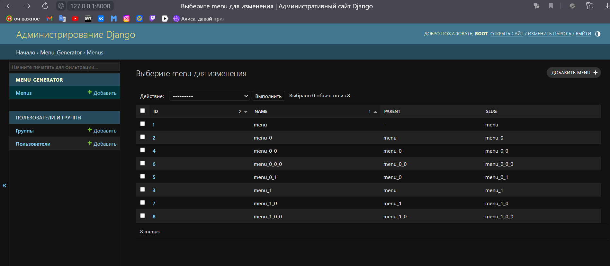
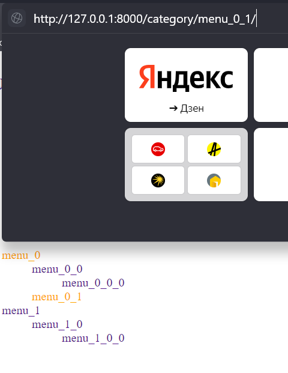
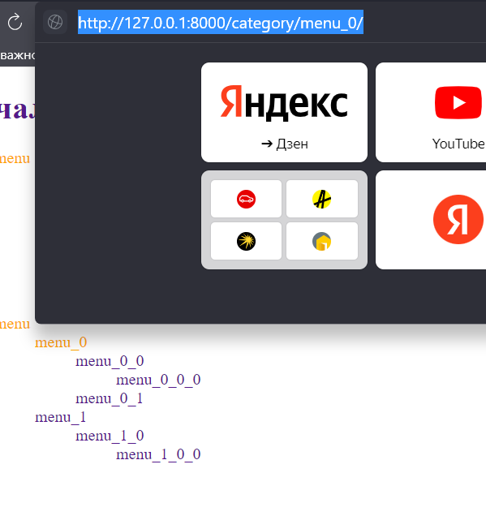

# Меню

### Домашняя страница - http://127.0.0.1:8000/base/
Использовал только django и стандартные библиотеки пайтона, sqlite (могу подмять всё под postgres, дело 5 минут)

Ссылки-заглушки ведут по slug'ам (get_absolute_url), место назначения можно поменять в views,
изначально все ведется на ту же страницу base.html.
Ссылки подсвечиваются в зависимости от выбранной категории.
Данные хранятся в бдшке sqlite, редактирование через админку.


Данные выводятся как через simple_tag, так и через inclusion,
функции идентичны, за исключением названия.


```html
    

    или 
    
    
```





